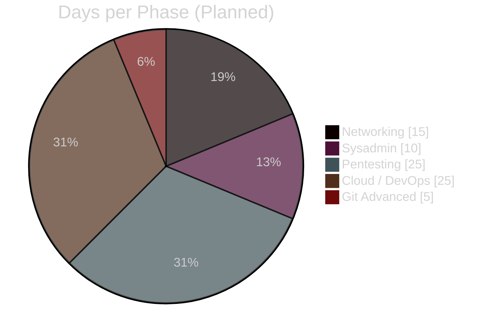
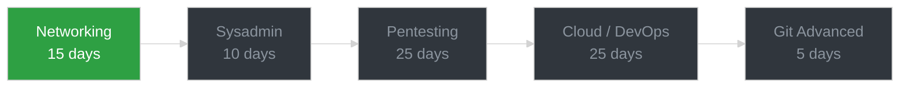

# 🛠️ Tools Journal

> **Practical-first documentation of every tool I learn, from networking to pentesting to cloud/DevOps.**
>
> Every tool = commands I ran myself, real output, mini challenges, mistakes and lessons learned.

<p align="center">
  
  
  
  
</p>

---

## 🎯 About This Repository

Hi, I'm Jeetendra — an IT professional (firewall, asset management, desktop support) moving toward ethical hacking and penetration testing.

This is my hands-on tools journal. It picks up after my [Linux fundamentals journey](https://github.com/Jeetendra-sanatani/linux-learning-journey) and works through real tools used in networking, system administration, security testing, and cloud/DevOps — one tool at a time, always practiced myself before it's written up.

> 🎯 **My goal:** build a working, honest record of every tool I actually use, not a list of things I've only read about.

**What this repository is NOT:**
- ❌ Copy-pasted tool documentation
- ❌ Commands I haven't actually run myself
- ❌ Output I didn't generate on my own machine
- ❌ Scans or attacks against systems I don't own or have permission to test

**What this repository IS:**
- ✅ Honest, self-paced, hands-on documentation
- ✅ Real terminal output from my own lab (Kali Linux + isolated VMs)
- ✅ Practical challenges attempted before checking the answer
- ✅ A resource for anyone learning the same tools

---

## 📊 Progress Dashboard



| Metric | Value |
| --- | --- |
| 📅 Phases planned | **5** |
| 🎯 Current phase | **Networking** |
| 🗓️ Total days planned | **~80** |
| 🧪 Practical focus | **80%** |
| 🚦 Status | **In Progress** |

---

## 🗺️ Roadmap



| Phase | Focus | Tools/Topics |
| --- | --- | --- |
| **1. Networking** | Reachability, DNS, scanning, packet capture | ping, traceroute, mtr, dig, nslookup, whois, curl, nmap, netcat, tcpdump, Wireshark |
| **2. Sysadmin** | Real server administration | tmux, lsof, strace, iptables, fail2ban, logrotate, auditd, ncdu |
| **3. Pentesting** | Legal, lab-only security testing | theHarvester, Burp Suite, gobuster/ffuf, nikto, ZAP, sqlmap, Metasploit, John the Ripper, hashcat, hydra, LinPEAS, GTFOBins |
| **4. Cloud / DevOps** | Infrastructure and automation | Docker, Kubernetes, Terraform, Ansible, AWS CLI, GitHub Actions, Python for DevOps |
| **5. Git Advanced** | Real-world version control | branching, merge vs rebase, stash, cherry-pick, conflicts, hooks |

---

## 🎯 How This Journal Works

Every tool follows the same structure. Theory stays minimal, practice takes up 80% of the space.

| Section | What I document |
| --- | --- |
| ⚡ **Quick Theory** | Only the minimum concept needed to understand the tool |
| 💻 **Lab / Hands-On** | Real commands I ran, in my own lab |
| 📤 **Output** | My own actual terminal output — never invented |
| 🎯 **Mini Challenges** | A practical problem to solve, solution hidden until opened |
| 🐛 **Errors / Gotchas** | Mistakes I hit and how I fixed them |

**Practice rule:** every scan, capture, or attack tool is run only against machines I own or that explicitly allow it (my own Kali VM, isolated lab VMs, or permitted targets like `scanme.nmap.org`). Nothing here is run against systems I don't have permission to test.

---

## 📂 Repository Structure

```text
tools-journal/
│
├── README.md
│
├── Networking/
│   ├── Day-01-ping-traceroute-mtr/
│   │   ├── README.md
│   │   ├── LAB.md
│   │   ├── commands.txt
│   │   ├── notes.txt
│   │   └── screenshots/
│   ├── Day-02-dig-nslookup-whois/
│   └── ...
│
├── Sysadmin/
├── Pentesting/
├── Cloud-DevOps/
└── Git-Advanced/
```

Each tool's folder contains:
- `LAB.md` — the commands to run, with nothing filled in (what I work from)
- `README.md` — the finished write-up, built from my own real output
- `commands.txt` — a clean copy-paste reference sheet
- `notes.txt` — my own fill-in notes, observations and challenge answers
- `screenshots/` — proof I actually ran it

---

## 🧭 Phase Index

| Phase | Status | Link |
| --- | --- | --- |
| 1. Networking | 🔵 In Progress | [Networking/](./Networking/) |
| 2. Sysadmin | ⏳ Upcoming | — |
| 3. Pentesting | ⏳ Upcoming | — |
| 4. Cloud / DevOps | ⏳ Upcoming | — |
| 5. Git Advanced | ⏳ Upcoming | — |

---

## 🔗 Related

- [linux-learning-journey](https://github.com/Jeetendra-sanatani/linux-learning-journey) — my earlier 30-day Linux fundamentals journal, which this repository continues from.

---

<p align="center">
🛠️ Practice • 📝 Document • 🔐 Secure<br/>
<b>One tool at a time, always run myself first.</b>
</p>
